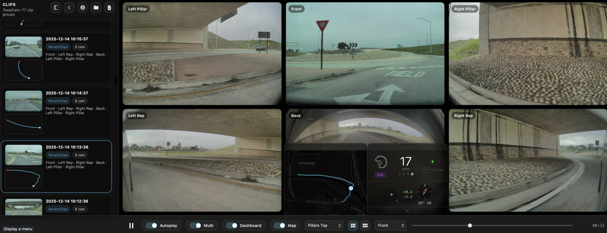

# Tesla Replay

[**Use the hosted version →**](https://martyearthy.github.io/teslareplay/)

A modern web-based tool for viewing Tesla Dashcam footage with integrated telemetry visualization. This application parses MP4 files directly in your browser, extracts the embedded SEI (Supplemental Enhancement Information) metadata, and overlays driving data in real-time.

Original code from Tesla: https://github.com/teslamotors/dashcam



## Features

- **Local Video Playback**: Uses the browser's native `VideoDecoder` API to play MP4 files frame-by-frame with precise synchronization.
- **Privacy-First**: All processing happens locally in your browser. No video or telemetry data is uploaded to any server. Your dashcam footage never leaves your machine.
- **TeslaCam Folder Support**:
  - Drop your entire `TeslaCam/` folder (or choose it in the UI) instead of picking single files.
  - Automatically groups per-camera clips into a single "clip group" by timestamp.
  - Tags clip groups by folder (e.g. `RecentClips`, `SentryClips`, `SavedClips`) and Sentry event folder when present.
- **Sentry Collections (Event Folder Playback)**:
  - Sentry events are stored as folders containing multiple 1‑minute segments before/after an event timestamp.
  - Tesla Replay can treat each Sentry event folder as a single **collection item** with "virtual playlist" playback.
  - A red event marker shows where the `event.json.timestamp` falls within the collection timeline.
- **Clip Browser + Previews**:
  - Sidebar clip list with **lazy** thumbnail generation and a **mini route preview** (from SEI GPS) when available.
  - Designed to scale to large folders without eagerly loading every MP4 into memory at once.
- **Multi‑Camera Playback (6-camera 3×2 grid)**:
  - Plays up to 6 cameras in sync (Front/Back/Left Repeater/Right Repeater/Left Pillar/Right Pillar) using WebCodecs decoding per camera.
  - Layout presets (spatial arrangement or front/back prioritized) + per-tile focus mode for quick inspection.
  - Legacy 4-camera layouts (2×2 grid) also available for older recordings.
- **Telemetry Dashboard**:
  - **Speed**: Current vehicle speed displayed prominently in MPH.
  - **Gear Indicator**: Visual indicators for Park, Reverse, Neutral, and Drive states.
  - **Turn Signals**: Animated left/right blinker indicators that activate with vehicle signals.
  - **Steering Wheel**: A realistic Tesla yoke-style steering wheel that rotates in real-time based on steering angle data.
  - **Autopilot Status**: Color-coded badge showing Manual, TACC (Traffic-Aware Cruise Control), Autosteer (AP), or Full Self-Driving (FSD) modes.
  - **Pedals**: Visual feedback for accelerator pedal position (0-100% bar) and brake application indicator.
  - **G-Force Meter**: Real-time visualization of lateral and longitudinal acceleration with an animated dot that moves based on vehicle dynamics. Color-coded for braking (red), acceleration (green), and hard cornering (orange).
  - **Heading Compass**: A rotating compass needle showing the vehicle's current heading direction with cardinal direction labels (N, NE, E, SE, S, SW, W, NW) and numeric degrees.
  - **Expandable Details**: Collapsible panel showing GPS coordinates (Latitude/Longitude), heading degrees, and frame sequence number.
  - **Draggable Window**: The dashboard is a floating panel that can be repositioned anywhere on the screen.
  - **Toggle On/Off**: Dashboard visibility can be toggled from the control bar.
- **Interactive Map**:
  - **Route Plotting**: Automatically draws the vehicle's full path on a map using extracted GPS data.
  - **Real-time Tracking**: Shows the car's current position as the video plays, updating frame-by-frame.
  - **Draggable Window**: The map runs in its own floating window that can be positioned anywhere on the screen.
  - **Toggle On/Off**: Map visibility can be toggled from the control bar.

https://x.com/MartyEarthy/highlights

## For Users

### Quick Start (Recommended)
The easiest and most powerful workflow is to give Tesla Replay the **entire `TeslaCam/` folder** from your USB stick. This allows the app to index all your clips, group them by timestamp, show thumbnails and route previews, and let you browse everything in one place.

1. **Launch the app**
   - Use the hosted version: [**martyearthy.github.io/teslareplay**](https://martyearthy.github.io/teslareplay/)
   - Or run locally (see "Running Locally" below for instructions on setting up a local web server).

2. **Load your TeslaCam folder (best experience)**
   - **Drag & drop** the `TeslaCam/` folder directly onto the app window, **or**
   - Click the drop zone in the center and choose **Choose Folder**, **or**
   - Use the sidebar "Clips" panel and click the **Folder** button.
   - The app will recursively scan all subfolders (`RecentClips`, `SentryClips`, `SavedClips`) and index every MP4 file it finds.

3. **Browse your clips**
   - The left sidebar displays **clip groups** (a single timestamp that may have multiple camera angles).
   - Each row will progressively fill in with:
     - A **thumbnail** preview (generated lazily as you scroll)
     - A **minimap route preview** showing the GPS path (when SEI data is present)
     - Folder badges like `RecentClips`, `SentryClips`, or `SavedClips` indicating where the clip came from
     - For Sentry events, a red dot on a timeline bar showing exactly when the event was triggered

4. **Play your footage**
   - Click any clip row to load it into the player.
   - Use **Autoplay** (toggle in the control bar, default ON) to automatically start playback whenever you:
     - Select a different clip group
     - Switch camera angles
     - Load a single MP4 file
   - Use **Play/Pause** button or press `Spacebar` to toggle playback at any time.
   - Use the timeline scrubber or `Left/Right Arrow` keys to jump through frames precisely.
   - The current frame's telemetry data (speed, steering, GPS, etc.) updates in real-time as you play or scrub.

### Multi‑Camera Playback (3×2 / 2×2 Grids)
Tesla Replay includes a powerful synced **multi-camera** mode, which is ideal for reviewing a moment across all available camera angles simultaneously.

- **Enable/disable**: Use the **Multi** toggle in the control bar (default ON for the best experience).
- **What you see**: A 3×2 grid that shows up to 6 camera feeds playing in perfect sync, or a 2×2 grid for legacy 4-camera recordings.
- **6-camera layout presets** (default for newer firmware with pillar cameras):
  - **6-cam Default** = Left Pillar, Front, Right Pillar (top row) / Left Repeater, Back, Right Repeater (bottom row) — matches the physical camera positions on the vehicle
  - **6-cam Repeaters Top** = Left Repeater, Front, Right Repeater (top row) / Left Pillar, Back, Right Pillar (bottom row)
  - **6-cam F/B First** = Front, Back, Left Repeater (top row) / Right Repeater, Left Pillar, Right Pillar (bottom row) — prioritizes front and back views
- **4-camera layout presets** (for older recordings without pillar cameras):
  - **4-cam F/B/L/R** = Front, Back (top row) / Left Repeater, Right Repeater (bottom row)
  - **4-cam F/B/R/L** = Front, Back (top row) / Right Repeater, Left Repeater (bottom row)
- **Layout switching**: Use the dropdown menu to select any layout, or use the two quick-switch icon buttons for instant toggling between your most-used layouts.
- **Master camera**:
  - In Multi mode, the **Camera dropdown selects the "master camera"**.
  - The master camera drives:
    - The scrubber timeline (frame count and duration)
    - The dashboard telemetry display (speed, steering, GPS, etc.)
    - The map route visualization and current position marker
  - Other cameras are synchronized to the master camera's timestamp, so all feeds show the same moment in time.
- **Focus mode per tile**:
  - Click any individual camera tile to **enlarge** it to full size for detailed inspection.
  - Click the enlarged tile again or press **Esc** to return to the grid view.
  - This is perfect for quickly inspecting a specific angle without leaving multi-camera mode.

### Sentry Collections (One Item per Event Folder)
Tesla stores Sentry mode footage as a folder per event, containing multiple 1-minute clips recorded before and after the "trigger moment" when motion was detected.

Tesla Replay intelligently groups each Sentry event folder into a single **Sentry Collection** list item for seamless playback:

- **What is a "collection"?**
  - A collection is a virtual timeline spanning multiple 1‑minute camera segments.
  - During playback, the app automatically advances through segments when one ends; you may notice a small loading hitch at segment boundaries (this is expected and normal).
  - The timeline scrubber shows the total collection duration in milliseconds, not individual frame counts.

- **Event marker**
  - If `event.json` is present in the Sentry folder, Tesla Replay uses `event.json.timestamp` to compute exactly where the triggering event occurred within the collection.
  - The clip list shows a **red dot** on a small timeline bar to visually indicate where the event happens — making it easy to jump directly to the important moment.

- **Event details popout**
  - If the Sentry folder contains `event.json`, a small info button (ⓘ) appears on the collection row in the clip list.
  - Clicking it opens a readable panel showing all JSON fields: reason, city, street, latitude, longitude, timestamp, and more.
  - Close the popout by clicking the ✕ button, clicking outside the panel, or pressing `Esc`.

- **Thumbnails**
  - If `event.png` exists in the Sentry folder, Tesla Replay uses it as the collection's thumbnail for fast, consistent display.
  - Otherwise, a thumbnail is generated from the first available video frame.

### TeslaCam Folder Structure Notes
Tesla Replay expects the standard Tesla USB folder structure that the vehicle creates automatically:

```
TeslaCam/
├── RecentClips/
│   └── *.mp4
├── SentryClips/
│   └── <event-id>/
│       ├── *.mp4
│       ├── event.json
│       ├── event.mp4
│       └── thumb.png
└── SavedClips/
    └── <timestamp>/
        └── *.mp4
```

Within each folder, Tesla writes per-camera files named with this pattern:

- `YYYY-MM-DD_HH-MM-SS-front.mp4` — Forward-facing main camera
- `YYYY-MM-DD_HH-MM-SS-back.mp4` — Rear-facing camera
- `YYYY-MM-DD_HH-MM-SS-left_repeater.mp4` — Left side mirror camera
- `YYYY-MM-DD_HH-MM-SS-right_repeater.mp4` — Right side mirror camera
- `YYYY-MM-DD_HH-MM-SS-left_pillar.mp4` — Left B-pillar camera (newer vehicles only)
- `YYYY-MM-DD_HH-MM-SS-right_pillar.mp4` — Right B-pillar camera (newer vehicles only)

Tesla Replay groups these into a single **clip group** by the shared timestamp (`YYYY-MM-DD_HH-MM-SS`) plus the parent folder tag (and Sentry "event folder" ID when present).

> **Note**: Some Sentry event folders include `event.mp4` (a low-resolution composite video). Tesla Replay focuses on the full-resolution per-camera feeds; `event.mp4` is currently ignored.

### Camera Angle Switching
Use the **Camera** dropdown in the control bar to switch between available angles for the currently selected clip group.

- The dropdown shows all cameras that exist for the current clip (e.g., if a clip only has front/back/left_repeater/right_repeater, only those four will appear).
- If **Autoplay** is ON (default), switching cameras will immediately start playing the newly loaded camera file from the current position.
- The camera you select becomes the "master camera" in multi-cam mode, controlling the timeline and telemetry display.

### Clips Panel Modes (Floating / Docked / Collapsed)
The "Clips" panel on the left side serves as both a clip browser and settings surface. You can choose how it behaves to suit your screen size and preferences:

- **Floating**: The panel floats in the upper-left corner over the video area. Good for large screens where you want quick access without losing video space.
- **Docked**: The panel docks to the left edge of the window and **does not overlap the video playback area**. The video container adjusts to fit beside it. Ideal for browsing clips while watching.
- **Collapsed**: The panel shrinks to a small, unobtrusive button. Click to expand it when needed. Great for focusing on playback with maximum video space.

Toggle between modes using the buttons in the panel header (Dock/Float and Collapse/Expand icons). Your preference is remembered across page reloads via localStorage.

### Dashboard + Map Overlays
The telemetry dashboard and map are floating overlay windows that display real-time data extracted from the video's SEI metadata:

- **Dashboard Window**:
  - Displays current speed, gear state, turn signals, steering wheel angle (with animated yoke), autopilot status, and pedal positions.
  - Features a **G-Force meter** showing lateral (X) and longitudinal (Y) acceleration with an animated moving dot.
  - Features a **Heading compass** showing the vehicle's direction with a rotating needle and cardinal labels.
  - Expandable **Details** section shows GPS coordinates (Lat/Lon), heading in degrees, and frame sequence number.
  - Drag the panel by its top header (`:::`) to reposition it anywhere on screen.
  - Toggle visibility using the **Dashboard** checkbox in the control bar.

- **Map Window**:
  - Shows the complete driven route as a polyline (drawn from all GPS points in the clip).
  - A marker tracks the vehicle's current position during playback.
  - Drag the panel by its top header to reposition it.
  - Toggle visibility using the **Map** checkbox in the control bar.

### Keyboard Shortcuts
- `Spacebar` — Play/Pause toggle
- `Left Arrow` — Previous frame (or step backward in collections)
- `Right Arrow` — Next frame (or step forward in collections)
- `Esc` — Exit focused tile view (in multi-camera mode)

### Requirements / Compatibility
- **Browser**: A modern browser with WebCodecs `VideoDecoder` support. Recommended: Chrome, Edge, or Safari 16.4+.
- **Videos**: Tesla dashcam MP4 files (H.264 encoded).
- **SEI Telemetry Data**: Full telemetry (speed, GPS, steering, etc.) requires Tesla firmware **2025.44.25+** and **HW3+** hardware. Older firmware or HW2.5 vehicles may have limited or no SEI data. If the car is parked, SEI data may be absent even on supported firmware.

### Troubleshooting

- **Nothing loads when I click the page**:
  - If you opened `index.html` directly from disk (`file://` URL), your browser will block fetching `dashcam.proto` due to CORS restrictions.
  - **Solution**: Run via a local web server (see "Running Locally" below) or use the hosted version.

- **Clip list appears but no minimap route preview**:
  - Not all clips contain GPS/SEI data. Clips recorded while parked or from older firmware may lack telemetry.
  - The minimap will simply not appear for those clips (this is normal).

- **Folder selection doesn't show subfolders**:
  - Folder picking uses the `webkitdirectory` attribute, which is widely supported in Chromium browsers.
  - Safari support can vary by version.
  - **Tip**: Drag & drop of the folder is often the most reliable method across browsers.

- **Sentry collection playback seems "stuck" at segment boundaries**:
  - Try toggling Multi mode off and back on (this forces a reload of the current segment).
  - If you see console errors about missing `.map` files, those are harmless source-map 404s from vendor libraries.

- **Dashboard or Map not appearing**:
  - Check that the toggle checkboxes in the control bar are enabled (Dashboard ✓, Map ✓).
  - The panels may have been dragged off-screen. Try refreshing the page to reset positions.

- **Video playback is choppy**:
  - Multi-camera mode decodes up to 6 simultaneous video streams, which can be CPU-intensive.
  - Try closing other browser tabs or applications.
  - On less powerful devices, consider using single-camera mode (disable Multi toggle).

- **Reset UI state**:
  - Tesla Replay persists UI preferences in `localStorage`. If your layout gets into a strange state:
    - Open browser DevTools → Application → Local Storage
    - Clear entries starting with `teslareplay.`
    - Or clear all site data for the origin

## For Developers

### High-Level Architecture
Tesla Replay is intentionally "no build step": **vanilla HTML/CSS/JS** with modern Web APIs. There's no bundler, no transpiler, no npm dependencies to install. Just clone and serve.

The app is organized around several major subsystems:

1. **Playback + Telemetry (Single MP4)**
   - Parses an MP4 into frames with timestamps and attached SEI metadata
   - Decodes frames using **WebCodecs VideoDecoder** and draws them to `<canvas>`
   - Updates dashboard + map visualizations in lockstep with the currently displayed frame
   - Handles frame-accurate seeking by decoding from the nearest keyframe

2. **TeslaCam Folder Ingest + Clip Browser**
   - Accepts a dropped or picked folder of MP4s
   - Indexes files into timestamp-based **clip groups** with multiple cameras per group
   - Renders a sidebar list with **lazy previews** (thumbnails + mini route maps)
   - Loads a selected group + camera into the single-MP4 playback pipeline
   - Supports large folder hierarchies without upfront parsing of every file

3. **Multi-Camera Playback**
   - Loads multiple camera MP4s for a clip group simultaneously
   - Runs per-camera WebCodecs decode pipelines and synchronizes them by timestamp
   - Keeps dashboard + map tied to a "master camera" timeline
   - Supports configurable layout presets and a per-tile focus mode

4. **Sentry Collections**
   - Collapses each `SentryClips/<eventId>/` folder into a single UI item
   - Implements a "virtual playlist" timeline that maps a global ms offset → segment → local frame index
   - Displays an event marker derived from `event.json.timestamp` when available
   - Handles automatic segment transitions during continuous playback

5. **State & Transitions (Centralized)**
   - Runtime state is centralized in `src/state.js` and accessed through a single `state` object
   - The app maintains an explicit `state.mode` (`clip` vs `collection`) and uses transition helpers to prevent "poisoned state" across mode switches
   - UI preferences are persisted to localStorage for a "sticky" experience

### Repository Layout (Key Files)

- **`index.html`**
  - App shell + DOM structure (canvas elements, controls, floating panels)
  - UI hooks for folder and file selection (`#folderInput`, `#fileInput`)
  - Clip browser container (`#clipBrowser`) and list (`#clipList`)
  - Autoplay toggle (`#autoplayToggle`) and camera selector (`#cameraSelect`)
  - Multi-cam UI (`#multiCamGrid`, `#multiCamToggle`, `#multiLayoutSelect`, layout quick switch buttons)
  - Dashboard visibility toggle (`#dashboardToggle`) and Map visibility toggle (`#mapToggle`)
  - Telemetry dashboard panel with steering wheel SVG, G-force meter SVG, heading compass SVG
  - Loads the app via **native ES modules** (`<script type="module" src="script.js">`)

- **`style.css`**
  - Dark UI styling with glassmorphism effects
  - Clip browser sidebar styles (list rows, badges, thumbnail + minimap tiles)
  - Multi-cam grid layouts (3×2 and 2×2) + focus-mode styling with `data-columns` attribute
  - Docked/floating/collapsed panel layouts with smooth transitions
  - Dashboard component styling (steering wheel, G-force meter, compass, gear indicators, turn signals, pedals)
  - Map panel styling
  - Responsive behaviors

- **`script.js`** (module entrypoint)
  - Wires DOM events to subsystems and orchestrates the entire app
  - Imports shared config and helpers from `src/` using native ES modules
  - Uses `state` as the single source of truth for all runtime state
  - Contains all visualization update logic (dashboard, map, G-force meter, compass)

- **`src/state.js`**
  - Central runtime state (`state`) object with these top-level branches:
    - `state.mode`: `'clip'` | `'collection'` — current playback mode
    - `state.player`: contains `mp4`, `frames`, `decoders`, `playing`, `playTimer` flags
    - `state.library`: `clipGroups`, `clipGroupById`, `folderLabel` — indexed clip data
    - `state.selection`: `selectedGroupId`, `selectedCamera` — current selection
    - `state.multi`: multi-cam `enabled`, `layoutId`, `masterCamera`, `streams` object
    - `state.previews`: preview generation `cache`, `observer`, `queue`
    - `state.collection`: active Sentry collection playback state (segments, timeline, position)
    - `state.ui`: transient UI state (focus, popouts, scrubbing, dashboardEnabled, mapEnabled)

- **`src/storageKeys.js`**
  - Centralized `localStorage` key constants for UI persistence
  - Keys for: clips panel mode, multi-cam enabled state, layout preference, dashboard visibility, map visibility

- **`src/multiLayouts.js`**
  - Multi-cam layout preset definitions (`MULTI_LAYOUTS` object)
  - Each layout specifies: `name`, `columns`, and `slots` mapping (which camera goes in which grid position)
  - Default layout constant (`DEFAULT_MULTI_LAYOUT`)
  - Supports both 6-camera (3×2) and 4-camera (2×2) configurations

- **`src/panelMode.js`**
  - Clips panel mode controller (floating/docked/collapsed)
  - Handles mode transitions and CSS class management
  - Persists mode preference to localStorage

- **`src/utils.js`**
  - Small shared helper functions
  - `escapeHtml()` — prevents XSS in dynamic content
  - `cssEscape()` — safely escapes strings for CSS selectors

- **`dashcam-mp4.js`**
  - **`DashcamMP4`** class: parses MP4 box/atom structure and returns video configuration + frame stream
  - SEI parsing helpers: detect "user data unregistered" payload (NAL type 6, payload type 5) and decode protobuf
  - Emulation prevention byte removal (critical for correct protobuf decoding)
  - `DashcamHelpers` utilities:
    - `initProtobuf()` loads `dashcam.proto` and initializes protobuf decoding with `{ keepCase: true }`
    - `getFilesFromDataTransfer()` recursively reads a dropped folder using `webkitGetAsEntry()`
    - `extractSeiMessages()` for bulk SEI extraction (useful for export features)

- **`dashcam.proto`**
  - Protobuf schema defining `SeiMetadata` message structure
  - Fields include: `vehicle_speed_mps`, `gear_state`, `steering_wheel_angle`, `autopilot_state`, `latitude_deg`, `longitude_deg`, `heading_deg`, `linear_acceleration_mps2_x/y/z`, `blinker_on_left/right`, `brake_applied`, `accelerator_pedal_position`, `frame_seq_no`, and more

- **`vendor/`**
  - `protobuf.min.js` — protobuf.js library for decoding Protocol Buffer messages
  - `jszip.min.js` — JSZip library (included for potential export features)

### Data Flow (Single MP4 Playback)

1. **File Selection**: User selects an MP4 (directly via file picker, drag-drop, or by clicking a clip group row).

2. **Loading**: `handleFile(file)` reads the file into an `ArrayBuffer` and constructs a `DashcamMP4` instance.

3. **Parsing**: `DashcamMP4.parseFrames(seiType)` scans the MP4 structure and returns `frames[]` array, where each frame includes:
   - `timestamp` (ms) — presentation timestamp
   - `duration` (ms) — frame duration derived from MP4 `stts` atom
   - `keyframe` (boolean) — true for IDR frames
   - `data` (Uint8Array) — H.264 NAL unit payload
   - `sei` (object | null) — decoded protobuf message with telemetry, or null if not present

4. **Initial Display**: The first frame is decoded and rendered, dashboard/map are initialized with route data.

5. **Playback**: `play()` starts a timer loop that:
   - Advances to the next frame
   - Calls `showFrame(index)` which:
     - Decodes from the nearest preceding keyframe to the target frame
     - Draws the decoded frame to the canvas
     - Calls `updateVisualization(sei)` to update dashboard components
     - Calls `updateGForceMeter(sei)` and `updateCompass(sei)` for instrument displays
     - Updates the map marker position

6. **Seeking**: When the user scrubs the timeline:
   - The target frame index is calculated
   - `showFrame()` decodes from the nearest keyframe (handles non-sequential access correctly)
   - All visualizations update to reflect the new position

### TeslaCam Folder Ingest (Clip Browser)

Folder ingest is designed to be "metadata-first" and scalable to hundreds of files:

- **Design Goal**: Don't load/parse all MP4s eagerly. Instead:
  - Index quickly from filenames and paths alone
  - Generate previews lazily as rows scroll into view
  - Only fully parse an MP4 when the user selects it for playback

#### Clip Grouping Rules

TeslaCam folders contain many MP4s that logically represent one "moment" in time across multiple cameras.

- **ClipGroup key** is derived from:
  - `tag` — folder under `TeslaCam/` (e.g., `RecentClips`, `SentryClips`, `SavedClips`)
  - `eventId` — Sentry only; the event folder name (e.g., `2025-12-14_09-57-33`)
  - `timestampKey` — extracted from filename: `YYYY-MM-DD_HH-MM-SS`

- **Cameras** are identified from the filename suffix:
  - `front`, `back`, `left_repeater`, `right_repeater`, `left_pillar`, `right_pillar`
  - Unknown suffixes are preserved as-is

- **ClipGroup structure** (stored in `state.library.clipGroups`):
  - `id: string` — stable unique identifier for UI keying
  - `filesByCamera: Map<cameraName, File>` — maps camera name to the actual File object
  - `timestampKey: string` — the shared timestamp
  - `tag: string` — folder tag
  - `eventId: string | null` — Sentry event ID if applicable

#### Folder Selection Mechanisms

Folder ingest supports multiple browser APIs:

1. **Drag & drop folder**
   - Uses `DataTransferItem.webkitGetAsEntry()` (Chromium-based browsers, some Safari builds)
   - Implemented by `DashcamHelpers.getFilesFromDataTransfer()`
   - To preserve folder structure for grouping, the helper stores `entry.fullPath` onto the `File` as a non-enumerable `_teslaPath` property

2. **Folder picker**
   - Uses `<input type="file" webkitdirectory multiple>`
   - Provides `file.webkitRelativePath` which is ideal for deriving tag/event folder structure

If neither API is available (rare), users can still load individual MP4 files directly.

### Preview Generation (Thumbnail + Mini Route)

The clip list generates previews lazily using `IntersectionObserver`:

- **Visibility Detection**: When a clip row scrolls into view, its preview generation is queued.

- **Minimap Route Preview**:
  - Reads SEI messages from a representative file (prefers `front` camera for consistency)
  - Extracts all GPS points (`latitude_deg`, `longitude_deg`) from SEI data
  - Down-samples points for performance and draws a polyline on a tiny canvas
  - Provides instant visual indication of the route without loading the full video

- **Thumbnail Generation** (two strategies):
  1. **Preferred**: Snapshot via an off-DOM `<video>` element
     - Waits for `loadedmetadata` event
     - Seeks slightly forward to get an actual frame
     - Draws the video frame to a thumbnail canvas
  2. **Fallback**: WebCodecs decoding of the first keyframe directly from MP4 bytes
     - More reliable for Tesla MP4s that may have quirky video element behavior
     - Decodes just enough frames to get a displayable image

- **Caching**: Previews are cached in `state.previews.cache` to avoid regenerating on scroll.

- **Concurrency**: A small concurrency limit prevents overwhelming the browser when many rows come into view at once.

### Autoplay Behavior

Autoplay is controlled by `#autoplayToggle` (default: ON).

- When enabled, after any file load completes and the first frame is rendered, the app automatically calls `play()`.
- This provides a smooth experience where selecting a clip or switching cameras immediately starts playback.
- Users who prefer manual control can disable autoplay; playback will then only start on explicit play button press or spacebar.

### Multi‑Camera Playback (Implementation Details)

Multi-camera mode runs entirely in the frontend with no server-side dependencies.

#### Concepts

- **Slots vs Cameras**:
  - The grid UI is treated as a set of **UI slots** (`tl`, `tc`, `tr`, `bl`, `bc`, `br` for 6-camera; `tl`, `tr`, `bl`, `br` for 4-camera)
  - Each slot is mapped to a camera key based on the current layout preset
  - Layout presets are defined in `src/multiLayouts.js` as the `MULTI_LAYOUTS` object
  - This abstraction makes it easy to add new layouts without rewriting synchronization logic

- **Master Camera**:
  - The dashboard, map, and timeline all derive their data from the master camera's `frames[]` array
  - Other cameras use frame index mapping by timestamp to stay in sync
  - The master camera selection is exposed via the Camera dropdown in multi-mode

- **Grid Column Control**:
  - The grid uses CSS Grid with a `data-columns` attribute
  - `data-columns="3"` creates a 3×2 grid; `data-columns="2"` creates a 2×2 grid
  - When in 2-column mode, the `tc` and `bc` slots are hidden via CSS

#### Synchronization Strategy

For each master frame at timestamp `t`:
- Each non-master stream performs a binary search over its cached timestamp array
- Finds the frame index where `stream.frames[idx].timestamp <= t`
- Decodes from the nearest preceding keyframe up to the target frame
- This "simple and correct" baseline ensures all cameras show the same moment

#### Focus Mode

Focus mode is purely a UI/CSS concern:
- A CSS class `.multi-cam-grid.focused` combined with `data-focus-slot` attribute determines which tile is displayed full-size
- Clicking a tile sets focus; clicking again or pressing `Esc` clears it
- No changes to decode pipelines or synchronization are needed

### UI State Persistence (localStorage Keys)

Tesla Replay persists several UX choices for a "sticky" experience across sessions:

| Key | Values | Purpose |
|-----|--------|---------|
| `teslareplay.ui.clipsMode` | `floating` \| `docked` \| `collapsed` | Clips panel display mode |
| `teslareplay.ui.clipsPrevMode` | `floating` \| `docked` | Last non-collapsed mode (for restore) |
| `teslareplay.ui.multiEnabled` | `"1"` \| `"0"` | Multi-camera mode enabled |
| `teslareplay.ui.multiLayout` | layout ID string | Selected multi-cam layout preset |
| `teslareplay.ui.dashboardEnabled` | `"1"` \| `"0"` | Dashboard panel visibility |
| `teslareplay.ui.mapEnabled` | `"1"` \| `"0"` | Map panel visibility |

> Implementation note: All keys are centralized in `src/storageKeys.js` to avoid magic strings throughout the codebase.

### Sentry Collections (Implementation Details)

Sentry collections are designed to avoid heavy upfront parsing while providing seamless multi-segment playback:

- **Indexing**:
  - Sentry per-minute clips are first indexed as normal `ClipGroup` objects
  - `buildDisplayItems()` then groups all clips sharing the same `SentryClips/<eventId>` path
  - A single `collection` display item is emitted per event folder

- **Timeline Model**:
  - The collection has a global duration computed from the first and last segment filename timestamps
  - `progressBar` (the timeline scrubber) represents **milliseconds from collection start**, not frame index
  - `segmentStartsMs[]` array maps each segment's start time within the collection

- **Segment Selection**:
  - `showCollectionAtMs(ms)` determines the correct segment by comparing `ms` against `segmentStartsMs`
  - When the segment changes, the corresponding MP4(s) are loaded
  - Once loaded, the local frame index is calculated and displayed

- **Playback Loop**:
  - Collection playback schedules the next tick **only after** `showCollectionAtMs()` resolves
  - This prevents timer races that could double-schedule and cause playback to speed up at segment boundaries
  - If a segment is still loading, playback waits (with a short retry delay)

- **Event Marker**:
  - If `event.json` exists and `event.json.timestamp` parses successfully, an `anchorMs` position is computed
  - The clip list UI renders a red marker at `anchorMs / durationMs` percentage position
  - This provides instant visual indication of where the triggering event occurred

### Running Locally

Because the app uses `fetch('dashcam.proto')` for protobuf loading, opening the HTML file directly from disk (`file://` URL) won't work due to CORS restrictions. You must serve the files via HTTP.

**Python 3:**
```bash
cd /path/to/teslareplay
python3 -m http.server 8000
```

**Node.js (using http-server):**
```bash
npx http-server . -p 8000
```

**Node.js (using serve):**
```bash
npx serve . -l 8000
```

Then open `http://localhost:8000` in your browser.

### Dependencies

- **protobuf.js** (`vendor/protobuf.min.js`): Used for decoding the Protocol Buffer messages embedded in SEI NAL units. The Tesla dashcam proto schema defines all telemetry fields.

- **JSZip** (`vendor/jszip.min.js`): Included for potential export/download features (currently optional for main playback).

- **Leaflet** (loaded via CDN in `index.html`): Used for rendering the interactive map and plotting GPS coordinates. Provides the `L.map`, `L.tileLayer`, `L.polyline`, and `L.circleMarker` APIs.

### Key Components

#### MP4 Parsing & SEI Extraction

The `DashcamMP4` class implements a lightweight MP4 parser:

1. Scans the file for box/atom headers (`moov`, `mdat`, `stts`, etc.)
2. Extracts video configuration from `avcC` (SPS/PPS data)
3. Iterates through NAL units in `mdat`, looking for type 6 (SEI)
4. For SEI NAL units, looks for payload type 5 ("user data unregistered")
5. Strips emulation prevention bytes from the payload (critical step!)
6. Passes the cleaned payload to the protobuf decoder

#### Frame Synchronization

Instead of using a standard `<video>` element (which doesn't expose frame-accurate metadata), this app uses the WebCodecs `VideoDecoder` API:

1. Creates a `VideoDecoder` instance with appropriate H.264 configuration
2. Feeds frame data starting from keyframes
3. Receives decoded `VideoFrame` objects in the output callback
4. Draws frames to `<canvas>` using `drawImage()`
5. Associates exact SEI data with the specific frame being rendered

This approach provides:
- Perfect frame-level synchronization between video and telemetry
- Ability to scrub to any frame precisely
- No reliance on browser-specific video element behaviors

#### Mapping Logic

When a file is loaded:
1. All parsed frames are scanned for GPS coordinates (`latitude_deg`, `longitude_deg`)
2. Valid coordinates are collected into an array
3. A `L.polyline` is created to visualize the entire route immediately
4. During playback, a `L.circleMarker` is updated frame-by-frame to show current position
5. The map auto-fits to show the full route on initial load

### Implementation Notes & Lessons Learned

Critical details for anyone building their own parser or modifying this one:

1. **Protobuf & Case Sensitivity**:
   The standard `protobuf.js` library converts field names to camelCase by default (e.g., `vehicle_speed_mps` becomes `vehicleSpeedMps`). However, Tesla's `.proto` definitions use snake_case, and downstream code expects these names.
   
   **Solution**: Always initialize the parser with `{ keepCase: true }`:
   ```javascript
   protobuf.parse(protoText, { keepCase: true });
   ```

2. **SEI Parsing & Emulation Prevention**:
   Tesla embeds telemetry in "User Data Unregistered" SEI messages (NAL type 6, payload type 5).
   
   - **Critical**: Raw NAL units contain "emulation prevention bytes" (`0x03`) inserted to prevent false start codes (`0x000001`). You **must** strip these bytes before decoding the protobuf message.
   - Failure to remove these bytes causes protobuf parsing to fail or produce corrupt data.
   - The sequence `0x00 0x00 0x03` becomes `0x00 0x00` after stripping.

3. **Variable Frame Rates**:
   Tesla dashcam footage is not always constant frame rate.
   
   **Solution**: Never assume 30 FPS. Read the `stts` (Sample To Time) atom from the MP4 `moov` header to get the exact duration of each frame. This is essential for smooth playback synchronization.

4. **Coordinate Systems**:
   - **Steering Angle**: Raw value is in degrees (positive = right turn, negative = left turn).
   - **Acceleration**: IMU values (`linear_acceleration_mps2_x/y/z`) are in meters per second squared (m/s²). Divide by ~9.81 to convert to G-forces.
   - **GPS**: `latitude_deg` and `longitude_deg` are in decimal degrees (WGS84).
   - **Heading**: `heading_deg` is 0-360 degrees clockwise from true north.

5. **Folder Ingest is Not "One API Fits All"**:
   - Drag/drop folder traversal relies on `DataTransferItem.webkitGetAsEntry()` — not consistently supported across all browsers.
   - Folder picking uses `<input webkitdirectory>` — widely supported in Chromium, variable in Safari.
   - **Practical takeaway**: Support both APIs, treat paths as "best effort", never assume stable relative paths exist.

6. **Thumbnails from `<video>` Can Be Flaky**:
   Some browsers won't produce a drawable frame immediately after `loadeddata` fires.
   
   A robust thumbnail implementation:
   - Waits for `loadedmetadata`
   - Seeks slightly forward (e.g., 0.1 seconds)
   - Waits for `seeked` event
   - Uses `requestVideoFrameCallback()` when available
   
   **Better fallback**: Decode the first keyframe directly via WebCodecs — more reliable for local MP4s.

7. **Multi-Camera Decode Cost is Real**:
   The "decode from keyframe to target frame" approach is simple and correct, but CPU-intensive when scrubbing across 6 streams.
   
   Potential future optimizations:
   - Cache decoded frames around the current time window
   - Avoid recreating `VideoDecoder` instances for small seeks
   - Implement "decoder warm state" with smarter flush strategies
   - Consider downscaling decode outputs for multi-cam tiles

8. **Collections Require Careful Timebase Handling**:
   Collections switch the scrubber from "frame index" to "milliseconds from start".
   
   **Safari gotcha**: If you set a large slider `step` value (e.g., 100ms), Safari may snap programmatic updates unexpectedly, making playback appear stuck or jittery.
   
   **Solution**: Keep `step=1` and quantize only user-initiated scrubs, not programmatic updates.

9. **Timer Races Cause "Sudden Speed-Up" Bugs**:
   Any segment-based system with async loads can accidentally create overlapping timers.
   
   The safe pattern:
   ```javascript
   // 1. Cancel any existing timer
   if (player.playTimer) clearTimeout(player.playTimer);
   
   // 2. Perform the async load
   await loadSegment();
   
   // 3. Schedule next tick only AFTER load resolves
   player.playTimer = setTimeout(playNext, frameDelay);
   ```

10. **G-Force and Compass Require Validation**:
    SEI data may be missing, undefined, or contain invalid values.
    
    Always validate before using:
    ```javascript
    let heading = parseFloat(sei?.heading_deg);
    if (!Number.isFinite(heading)) heading = 0;
    heading = ((heading % 360) + 360) % 360; // Normalize to 0-360
    ```

### Public Release Notes (Recommended Polish)

If you host this publicly (GitHub Pages, etc.), these improvements enhance perceived quality:

- **Avoid source-map 404s in console**:
  Some vendor libraries reference `.map` files that may not be included. These errors are harmless but look concerning in DevTools. Either include the `.map` files or remove the `//# sourceMappingURL` comments from vendor bundles.

- **Consider replacing `alert()` with toasts**:
  Browser alerts are blocking and feel dated. A small non-blocking toast notification system is a great UX upgrade.

- **Test on multiple browsers**:
  WebCodecs behavior can vary between Chrome, Edge, and Safari. Test playback, seeking, and multi-camera on all target browsers.

### Design Notes for Future Work

This repo is structured so future features plug in cleanly:

- **6-Camera Playback Layouts** ✅ Implemented
  - Newer vehicles/firmware include B-pillar cameras (left_pillar, right_pillar)
  - The multi-cam system fully supports 3×2 grids with configurable layout presets
  - Adding new layouts requires only editing `src/multiLayouts.js`

- **Export Features** (Planned)
  - SEI extraction infrastructure exists (`DashcamMP4.extractSeiMessages()`)
  - Potential export formats:
    - CSV (telemetry data per frame)
    - GPX/GeoJSON (route paths for mapping applications)
    - Event summaries (JSON reports for Sentry clips)

- **Performance Optimizations** (Future)
  - Frame caching for smoother scrubbing
  - Web Worker-based decoding to keep UI responsive
  - Thumbnail generation in workers
  - IndexedDB caching for large libraries

- **Additional Visualizations** (Future)
  - Battery/energy data (if available in SEI)
  - More detailed autopilot state information
  - Timeline annotations for events
